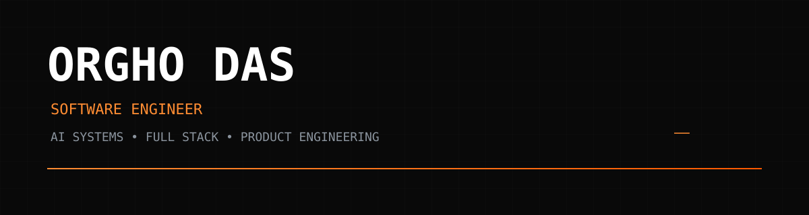
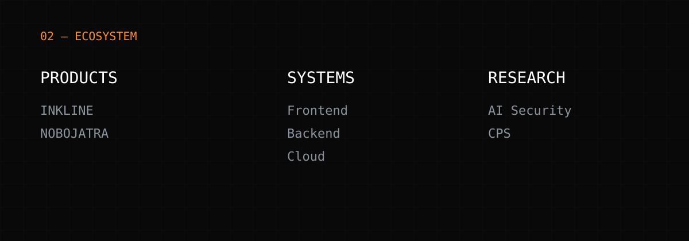
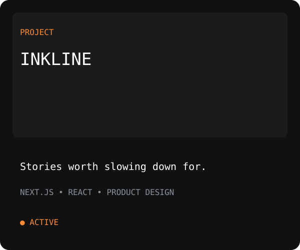
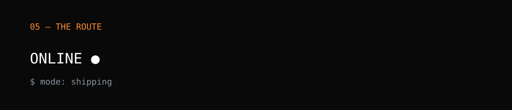
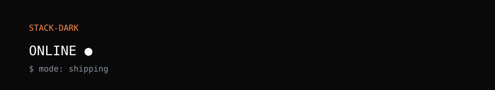

<!-- ─────────────────────────────────────────────────────────────
     profile readme · github.com/orghoDas
     every panel is a hand-built svg in /assets (light + dark) with
     a transparent ground, so each panel sits flush on github's own
     background in either theme and nothing renders broken.
     telemetry-*, activity-*, projects-* and proj-*-* (counts,
     contribution graph, language bars, star counts) are
     regenerated from live github data daily by
     .github/workflows/telemetry.yml — never edit those by hand.
────────────────────────────────────────────────────────────── -->

<picture>
  <source media="(prefers-color-scheme: dark)" srcset="assets/header-dark.svg">
  <source media="(prefers-color-scheme: light)" srcset="assets/header-light.svg">
  
</picture>

  
  
  
  

<picture>
  <source media="(prefers-color-scheme: dark)" srcset="assets/whoami-dark.svg">
  <source media="(prefers-color-scheme: light)" srcset="assets/whoami-light.svg">
  
</picture>

<picture>
  <source media="(prefers-color-scheme: dark)" srcset="assets/ecosystem-dark.svg">
  <source media="(prefers-color-scheme: light)" srcset="assets/ecosystem-light.svg">
  
</picture>

<picture>
  <source media="(prefers-color-scheme: dark)" srcset="assets/projects-dark.svg">
  <source media="(prefers-color-scheme: light)" srcset="assets/projects-light.svg">
  
</picture>

<!-- each card links to its repo · star counts are refreshed live by the telemetry workflow -->

  <a href="https://github.com/orghoDas/inkline"><picture><source media="(prefers-color-scheme: dark)" srcset="assets/proj-inkline-dark.svg"><source media="(prefers-color-scheme: light)" srcset="assets/proj-inkline-light.svg"></picture></a>
  <a href="https://github.com/Sakif16/nobojatra"><picture><source media="(prefers-color-scheme: dark)" srcset="assets/proj-nobojatra-dark.svg"><source media="(prefers-color-scheme: light)" srcset="assets/proj-nobojatra-light.svg"></picture></a>

<picture>
  <source media="(prefers-color-scheme: dark)" srcset="assets/telemetry-dark.svg">
  <source media="(prefers-color-scheme: light)" srcset="assets/telemetry-light.svg">
  
</picture>

<picture>
  <source media="(prefers-color-scheme: dark)" srcset="assets/activity-dark.svg">
  <source media="(prefers-color-scheme: light)" srcset="assets/activity-light.svg">
  
</picture>

<picture>
  <source media="(prefers-color-scheme: dark)" srcset="assets/route-dark.svg">
  <source media="(prefers-color-scheme: light)" srcset="assets/route-light.svg">
  
</picture>

<picture>
  <source media="(prefers-color-scheme: dark)" srcset="assets/stack-dark.svg">
  <source media="(prefers-color-scheme: light)" srcset="assets/stack-light.svg">
  
</picture>

<picture>
  <source media="(prefers-color-scheme: dark)" srcset="assets/footer-dark.svg">
  <source media="(prefers-color-scheme: light)" srcset="assets/footer-light.svg">
  
</picture>
